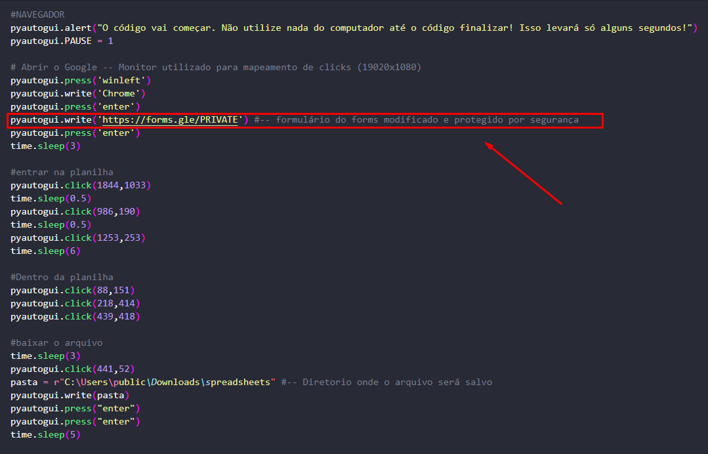
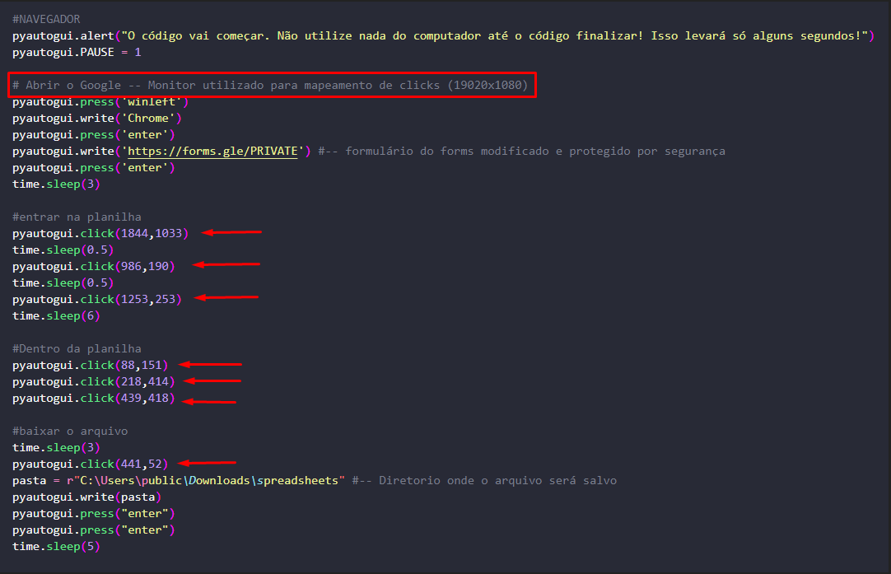
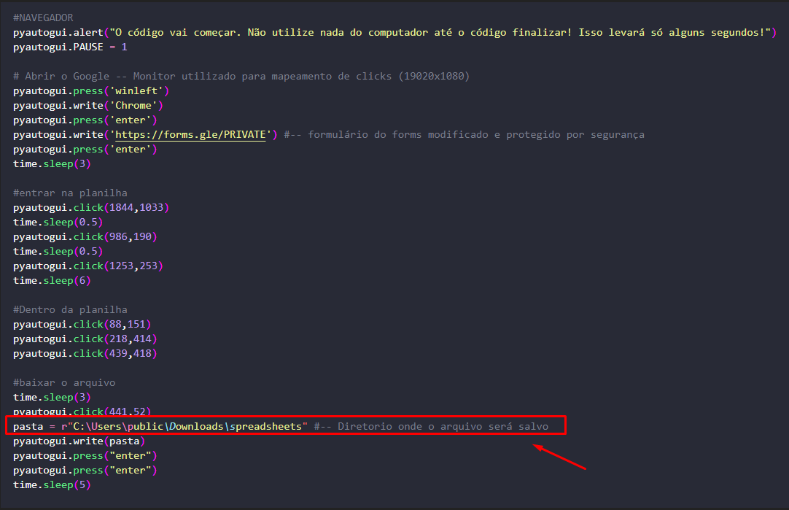

# Bem vindo ao repositório de RPA Google Forms com report por E-mail via Outlook!
Automação que utiliza O **Google Forms** para baixar uma planilha, tratar os dados  e enviar um relatório por **E-mail  através do Outlook.**

## Redes Sociais:
* [Site](https://portfolio-claudio.herokuapp.com)
* [Instagram](https://www.instagram.com/claudiogfez/)
* [Linkedin](https://www.linkedin.com/in/clcostaf/)  

# Instalação

1. Primeiramente você pode clonar este repositório.

```
$ git clone https://github.com/clcosta/RPA-Pandas-Outlook.git
```

2. Agora a instalação das bibliotecas

```
pip install -r requirements.txt
```

# Como utilizar
**Para está RPA funcionar será necessário fazer algumas alterações importantes!**

1. Será necessário colocar o link do formulário neste campo.

    

2. Modifique as posições de acordo com a sua resolução.  
	**Recomendo que utilize a documentação do PyautoGui para chegar as posições de click correta.**

    

3. Coloque o diretorio onde será instalado o arquivo.

	

4. Com tudo já instalado e modificações feitas é só executar!
```
python main.py
```

# Autor
| [<br><sub>@clcostaf</sub>](https://github.com/clcosta) |
| :---: |